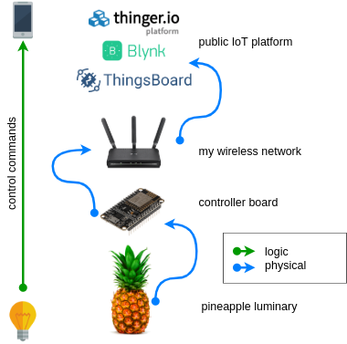

# esp-study 
Repositório de estudo da placa NodeMcu ESP8266

## Projeto Abacaxi ESP
#### Requisitos 
* Módulo ESP8266 
* PlatformIO 
* Blynk libs e aplicativo 

Esse projeto consistiu em controlar uma luminária de abacaxi utilizando a NodeMcu ESP8266 para controle dos LEDs e acesso a rede wireless, também utilizei a plataforma [Blynk](https://blynk.io/) que provê servidores e aplicativo para controlar a luminária diretamente pelo smartphone ([Android](https://play.google.com/store/apps/details?id=cc.blynk&hl=en_US)/[iOS](https://apps.apple.com/us/app/blynk-iot-for-arduino-esp32/id808760481)). 

## License 

[GPL-3.0 License](/LICENSE) © Hygor Jardim